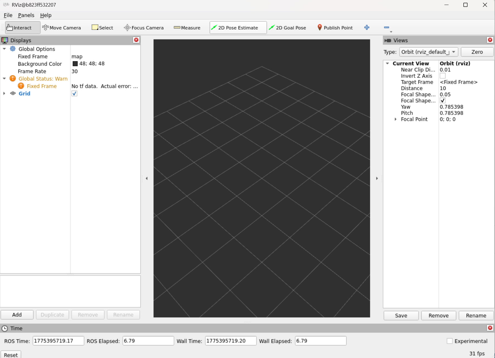

# 환경 설치 하는 법

* Windows 환경의 경우 docker desktop이 미리 세팅되어있어야 함

<br/>

터미널에 다음 커맨드를 입력

```
git clone https://github.com/YuriPark0123/SIOR_ROS_MoveIt_Study.git
cd SIOR_ROS_MoveIt_Study
docker compose up --build
```

화면에 rviz 화면이 떠야 정상




rviz 화면을 닫았다면 다음 명령어로 다시 rviz 화면에 접속할 수 있음
```
docker start ros2_moveit2 
```